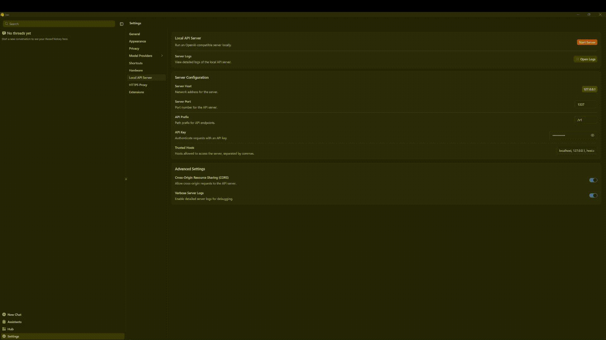

# PromptSan FastAPI - Anonymization Proxy Server (Work in progress)

A production-ready FastAPI server that provides OpenAI-compatible endpoints with intelligent anonymization using PromptSan. The server intercepts chat requests, anonymizes sensitive data using LLM + regex strategies, forwards to your LLM provider, and returns deanonymized responses in real-time.

## 🚀 Features

- **OpenAI-compatible API** - Drop-in replacement for OpenAI endpoints
- **Real-time streaming** - Supports both streaming and non-streaming responses  
- **Intelligent anonymization** - Combines LLM + regex for maximum accuracy
- **Production-ready** - Docker support, health checks, detailed logging
- **Multiple providers** - Works with OpenRouter, OpenAI, or any OpenAI-compatible API

## 📋 Prerequisites

- **Python 3.10+** (for local development)
- **Docker + Docker Compose** (for containerized deployment)
- **Jan AI** (local LLM server) - See setup section below
- **OpenRouter API key** (or other LLM provider)

## 🛠️ Quick Setup

### 1. Environment Configuration

Create your `.env` file:

```bash
# Copy the example environment file
cp .env.example .env
```

Edit `.env` with your settings:

```env
# Your OpenRouter API key (or other provider)
OPENAI_API_KEY=sk-or-your-openrouter-key-here
OPENAI_BASE_URL=https://openrouter.ai/api/v1
OPENROUTER_MODEL=mistralai/devstral-small

# PromptSan configuration
SANCONFIG_PATH=examples/fastapi/config.json
```

### 2. Jan AI Setup (Local LLM for Anonymization)

PromptSan uses a local LLM for intelligent anonymization. We recommend **Jan AI** for its simplicity:

#### Installation
1. **Download Jan**: Visit [jan.ai](https://jan.ai) and download for your OS
2. **Install the app** and launch it
3. **Download a model**: We recommend `jan-nano-4b-Q4_K_M` (small, fast, accurate)
4. **Start the local server**: Go to Settings → Advanced → Enable API Server
5. **Configure port**: Set to `1337` (default)

#### Docker Network Configuration
When running via Docker, Jan needs to accept connections from containers:

1. **Open Jan Settings** → Advanced → Local Server
2. **Add Trusted Hosts**:
   ```
   host.docker.internal,
   172.17.0.1,
   172.18.0.1,
   192.168.1.*
   ```

### 3. Configuration File

The `config.json` file defines your anonymization strategy:

```json
{
  "strategies": ["regex", "llm"],
  "llm_model": "jan-nano-4b-Q4_K_M",
  "llm_base_url": "http://host.docker.internal:1337/v1",
  "llm_prompt_template": "...",
  "regex_patterns": {}
}
```

Key settings:
- **strategies**: `["regex", "llm"]` for maximum accuracy
- **llm_base_url**: Use `host.docker.internal:1337` for Docker, `127.0.0.1:1337` for local
- **llm_model**: Match your Jan model name exactly

## 🔧 Running the Server

### Option 1: Local Development

```bash
# Install dependencies
pip install -r requirements.txt

# Start the server
uvicorn main:app --host 0.0.0.0 --port 9000 --reload
```

### Option 2: Docker (Recommended)

```bash
# Build and start
docker compose up --build -d

# View logs
docker compose logs -f api
```

## 🧪 Testing the API

### Health Check
```bash
curl http://localhost:9000/health
```

### Non-streaming Request
```bash
curl -X POST http://localhost:9000/v1/chat/completions \
  -H "Content-Type: application/json" \
  -H "Authorization: Bearer sk-or-your-key" \
  -d '{
    "model": "google/gemini-2.5-flash-lite",
    "messages": [
      {"role": "user", "content": "My email is john@secret.com and phone +1-555-123-4567"}
    ],
    "stream": false
  }'
```

### Streaming Request
```bash
curl -N -X POST http://localhost:9000/v1/chat/completions \
  -H "Content-Type: application/json" \
  -H "Authorization: Bearer sk-or-your-key" \
  -d '{
    "model": "google/gemini-2.5-flash-lite",
    "messages": [
      {"role": "user", "content": "Contact me at sarah@company.com or call +33-1-23-45-67-89"}
    ],
    "stream": true
  }'
```

## 📊 How It Works

1. **Client sends** chat request with sensitive data
2. **Server anonymizes** using LLM + regex (e.g., `john@email.com` → `__EMAIL_1__`)
3. **Anonymized request** forwarded to LLM provider (OpenRouter/OpenAI)
4. **Response streamed back** with tokens replaced by originals in real-time
5. **Client receives** fully deanonymized response

## Example using Jan AI



## 🔍 Example Output

**Input message:**
```
"Contact John Smith at john.smith@company.com or call +1-555-0123"
```

**Anonymized (sent to LLM):**
```
"Contact __PERSON_1__ at __EMAIL_1__ or call __PHONE_1__"
```

**Server logs:**
```
[ANONYMIZE] Original text: Contact John Smith at john.smith@company.com or call +1-555-0123
[ANONYMIZE] Anonymized text: Contact __PERSON_1__ at __EMAIL_1__ or call __PHONE_1__
[ANONYMIZE] Mapping: {
  "John Smith": "__PERSON_1__",
  "john.smith@company.com": "__EMAIL_1__", 
  "+1-555-0123": "__PHONE_1__"
}
[DEANONYMIZE] Restored: [Original response with real data restored]
```

## 🐛 Troubleshooting

### Common Issues

#### "LLM anonymization failed: Connection error"
- **Cause**: Jan server not running or not accessible
- **Fix**: Start Jan, enable API server, check trusted hosts

#### "Invalid host header" 
- **Cause**: Jan rejecting Docker requests
- **Fix**: Add `host.docker.internal` to Jan's trusted hosts

#### Streaming cuts off early
- **Cause**: Network timeout or buffer issues  
- **Fix**: Increase `max_tokens` in request, check Docker logs

#### "Missing API key"
- **Cause**: OpenRouter key not provided
- **Fix**: Set `OPENAI_API_KEY` in `.env` or pass via `Authorization` header

### Debug Commands

```bash
# Check Jan server
curl http://localhost:1337/v1/models

# Check Docker logs
docker-compose logs -f api

# Test local anonymization
python -c "from promptsan import PromptSanitizer; print('OK')"
```

## 📄 API Reference

The server implements OpenAI's Chat Completions API:

### Endpoint: `POST /v1/chat/completions`

**Request Body:**
```json
{
  "model": "string", // required
  "messages": [{"role": "user", "content": "string"}], // required
  "stream": false, // optional
  "temperature": 0.7, // optional
  "max_tokens": 1000, // optional
  "api_key": "optional-if-using-header" // optional
}
```

**Headers:**
```
Content-Type: application/json
Authorization: Bearer your-api-key
```

**Response:** Standard OpenAI format with deanonymized content

### Health Check: `GET /health`

Returns server status and config.

## 🤝 Contributing

This is an example implementation. For the core PromptSan library:

1. **Issues**: Report bugs or feature requests
2. **Pull Requests**: Submit improvements
3. **Documentation**: Help improve this README